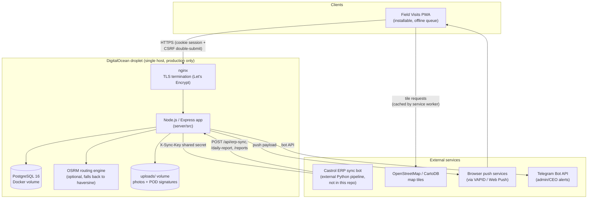

# Current-state architecture

This is a snapshot of `main` as of the quality-baseline work in September
2026 (see `docs/governance/README.md` for how this baseline was
established). It describes what actually runs today, not an aspirational
design — where something is a known gap, it's called out and cross-referenced
into the [risk register](risk-and-technical-debt-register.md) instead of
glossed over.

## System diagram

There is currently **one environment** (production, on the droplet above).
No staging environment exists yet — see
[change-management-policy.md](change-management-policy.md) for the plan and
what's still needed from repo ownership to stand one up.

## Application layers

- **Client** (`client/public/`): vanilla JS, no build step, no framework.
  Views under `js/views/`, a small router/app shell in `js/app.js`, a
  service worker (`sw.js`) for offline caching + the PWA install flow, and
  an offline write queue (`js/offlineQueue.js`) that replays queued
  check-ins/orders once connectivity returns.
- **Server** (`server/src/`): Express, one process per deployment (no
  clustering, no separate worker process). `src/app.js` builds the app
  (routes, middleware); `src/index.js` is the process entrypoint that also
  starts the in-process scheduled jobs (see below). Route handlers live
  under `src/routes/` (36 route modules as of this snapshot), one file per
  resource area.
- **Database**: PostgreSQL, plain SQL migrations under `server/migrations/`
  (75 files, applied in order by `server/src/db/migrate.js`; no ORM). 44
  tables as of this snapshot, spanning customers/checkins, orders/payments/
  delivery, performance plans, notifications, and audit/history tables.
- **Background jobs**: no separate job runner or queue. Periodic work
  (overdue-visit reminders, stale-packed-order alerts, ERP-sync-staleness
  monitoring, the daily unresolved-work summary) runs as plain
  `setInterval` timers inside the one Express process, started from
  `index.js`. This is a real scaling constraint — see the risk register.

## Integrations

| Integration | Direction | Mechanism | Notes |
|---|---|---|---|
| Castrol ERP sync bot | Inbound push | `POST /api/erp-sync`, `/api/erp-sync/daily-report`, `/api/erp-sync/reports`, header `X-Sync-Key: <ERP_SYNC_KEY>` | External Python pipeline (`ceo_agent.py` / `sync_field_visits.py`), not in this repo. Contract documented in `docs/erp-sync-contract.md`. TRUNCATE-and-replace semantics per table; `erpSyncMonitor.js` alerts admin/CEO if a sync goes stale (>72h). |
| Map tiles | Outbound | HTTPS to OpenStreetMap / CartoDB basemap CDNs | No API key; cached by the service worker and pre-warmed for Armenia's bounding box during idle time. |
| OSRM routing | Internal | HTTP to a self-hosted OSRM container | Optional dependency for the delivery Route Planner; the app falls back to straight-line (haversine) distance if unreachable. Requires a manually pre-processed `.osm.pbf` extract (see `docker-compose.yml` comments) — this is a manual, undocumented-in-CI step. |
| Web Push | Outbound | `web-push` npm package, VAPID keys | Disabled entirely if `VAPID_PUBLIC_KEY`/`VAPID_PRIVATE_KEY` are unset (as they are in this session's dev/test environment). Delivery attempts + retries logged to `notification_delivery_log`. |
| Telegram Bot API | Outbound | Bot token + chat IDs | Used for admin/CEO alerts; disabled if unconfigured. |

## Roles and access model

Seven roles (`server/src/roles.js`): `admin`, `ceo`, `sales_director`,
`sales_manager`, `warehouse_manager`, `delivery_manager`, `accountant`.
Access is enforced entirely in application code (per-route capability
functions like `canDeliverOrders`, `seesFinancialExports`,
`canReassignCustomers`) reading the role off the authenticated user — there
is no database-level row-level security. `sales_manager` is the only role
scoped to "own data only" by default; every other role sees company-wide
activity, with narrower carve-outs (e.g. only `admin`/`ceo`/`sales_director`/
`accountant` can pull financial CSV exports).

## Authentication and session

Email + password (bcrypt), a JWT in an httpOnly `session` cookie
(`sameSite=lax`, 30-day expiry), plus (as of the security-hardening round)
a double-submit CSRF cookie/header pair on every mutating request. Per-
account lockout after 5 consecutive failed logins, on top of an IP-scoped
rate limiter. See `docs/governance/service-objectives-and-security.md` for
the fuller security posture.

## Deployment topology

Docker Compose on a single DigitalOcean droplet: `app` (this repo's
Node.js server), `db` (Postgres), `osrm` (optional). nginx in front does
TLS termination via Let's Encrypt/certbot. Deploys are manual: SSH to the
droplet, `git pull`, run `./deploy/deploy.sh`, which builds the image, runs
migrations, runs `npm test` + `npm run verify:ui` + `npm run
verify:deployment` as pre-flight gates, then restarts the `app` container.
Full walkthrough: `deploy/digitalocean.md`.

As of this snapshot: **no CI existed until the security-hardening PR
(#132) added `.github/workflows/ci.yml`.** Every prior change reached
`main` and then production through a manually-run deploy script, with no
automated gate before that point. That gap is now closed for `main` (CI
required, see [definition-of-done.md](definition-of-done.md)); the deploy
script's own pre-flight checks remain the last line of defense against a
bad deploy reaching users.
